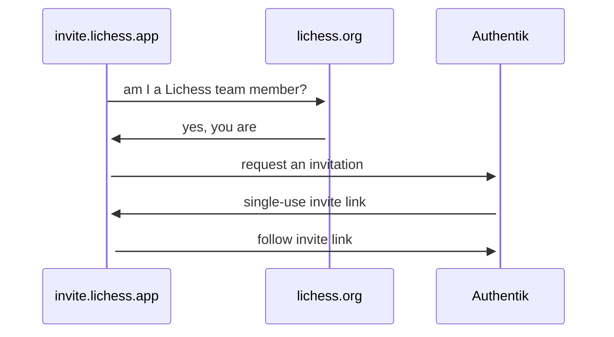

## Usage

```bash
sbt app/run
```

http://localhost:8080/

```bash
### or with custom port and Lichess host:

PORT=8000 \
LICHESS_HOST=http://localhost:8080 \
AUTHENTIK_HOST=http://localhost:9000 \
AUTHENTIK_TOKEN=token \
sbt app/run
```

### Development

```bash
sbt scalafmt

sbt scalafix
```

### Docker

To test the Docker image locally:

```bash
sbt Docker/publishLocal
```
