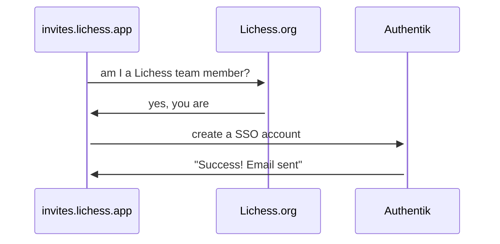

```mermaid
sequenceDiagram
    invites.lichess.app->>+Lichess.org: am I a Lichess team member?
    Lichess.org->>+invites.lichess.app: yes, you are
    invites.lichess.app->>+Authentik: create a SSO account
    Authentik->>+invites.lichess.app: "Success! Email sent"
```

## Usage

```bash
sbt app/run
```

http://localhost:8080/

```bash
sbt app/run

### or with custom port and Lichess host:

PORT=8000 LICHESS_HOST=http://localhost:8080 sbt app/run
```
