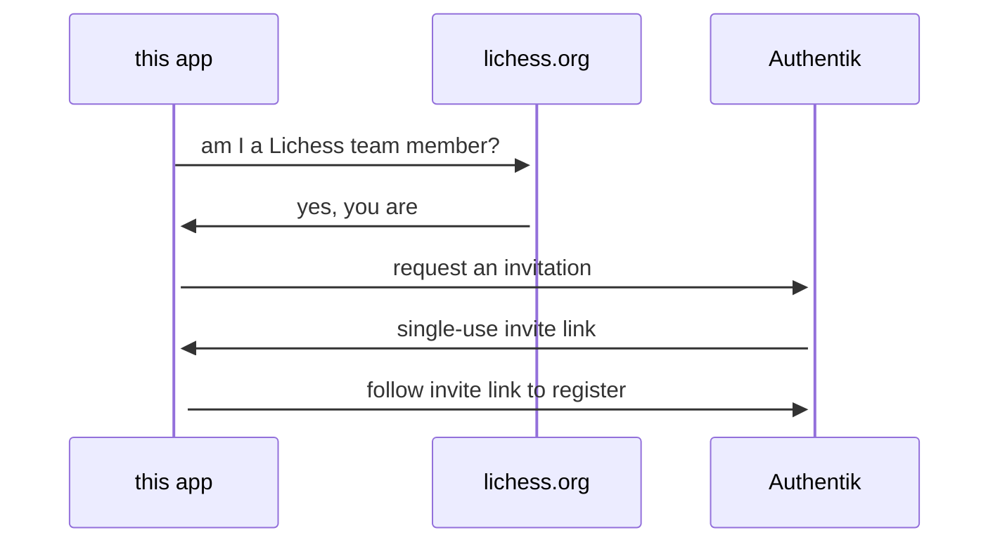

## Usage

```bash
sbt app/run
# open http://localhost:8080/
```

```bash
# or use a custom port with a different local lila hostname
PORT=8000 \
LICHESS_HOST=http://localhost:9663 \
sbt app/run
# open http://localhost:8000/
```

```bash
# or customize everything
PORT=8000 \
LICHESS_HOST=http://localhost:8080 \
AUTHENTIK_HOST=http://localhost:9000 \
AUTHENTIK_TOKEN=token \
sbt app/run
# open http://localhost:8000/
```

### Development

```bash
sbt scalafmt

sbt scalafix

yamlfmt .github
```

### Docker

To test the Docker image locally:

```bash
sbt Docker/publishLocal

docker run --rm -p 8000:8080 lichess-team
```
